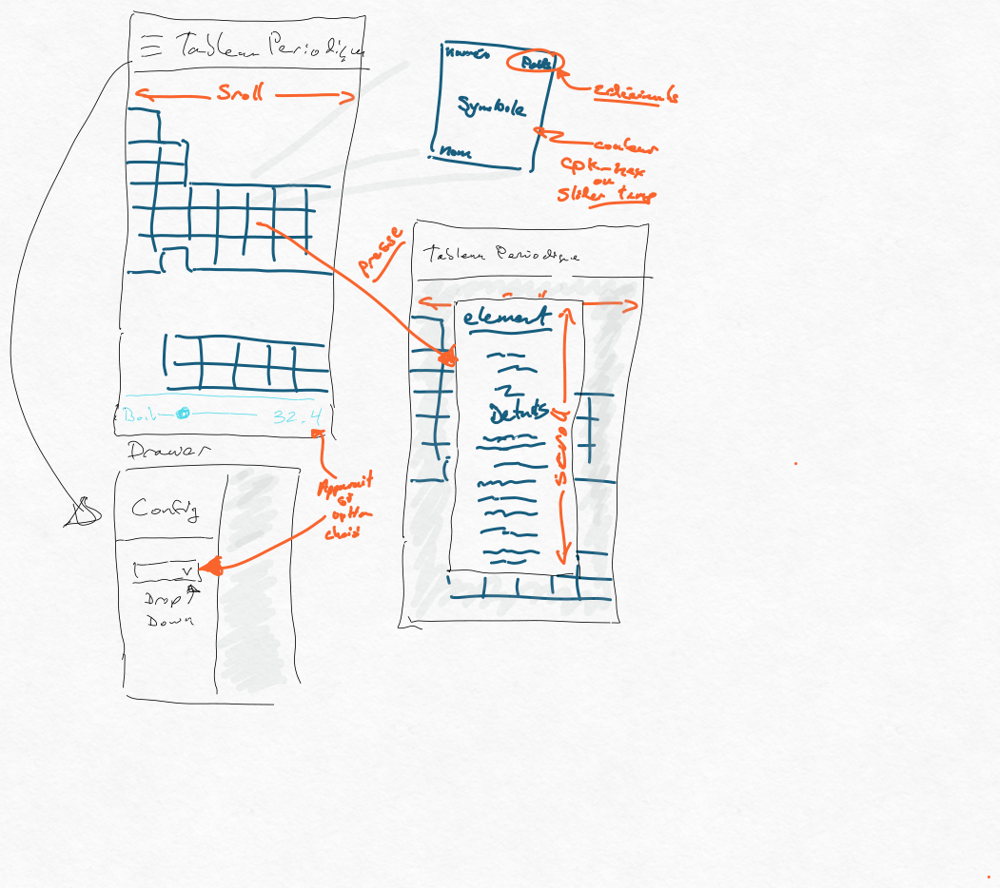

# Consignes

* Le travail est à réaliser individuellement
* Ce travail compte pour 15 % de la note finale
* La date de remise est le 
  * Groupe 1 : 20 mars 2024 à 20:20
  * Groupe 2 : 21 mars 2024 à 20:20
* Le travail doit être remis par « commit » dans le projet Github Classroom, aucune autre méthode de remise ne sera acceptée
* Tout retard dans la remise de ce travail entraînera une pénalité de 10% par jour de retard jusqu’à concurrence de 5 jours. Après cette date, la note de zéro sera attribuée au travail.

# Contexte du travail pratique

Les chimistes ont beaucoup apprécié le travail fait lors de l'exercice et désirent maintenant avoir une application leur permettant de visualiser le tableau périodique et récupérer les détails sur un élément en cliquant sur ce dernier. 

Dans ce travail pratique, vous allez créer une application permettant de visualiser un tableau périodique. 
 
# Exigences conceptuelles 

## Vue du tableau

Les détails sur l'aspect graphique du tableau sont libres. Cependant, vous devez respecter les éléments décris dans cette section.

Les chimistes ont fourni une esquisse de ce qu'ils espèrent avoir avec l'application. Les points importants étant:
* L'application doit avoir une barre dans le haut indiquant "CAL tableau périodique"
* Le tableau périodique doit prendre toute la taille de l'écran en hauteur.
    * Rechercher LayoutBuilder pour vous permettre d'ajuster cet élément
* Le tableau sera plus large que l'écran, il doit être possible de faire défiler le tableau horizontalement.
* L'application doit supporter une vue portrait et paysage suivant l'orientation de l'appareil.
* Chaque cellule du tableau doit contenir les éléments suivants si la taille de la cellule le permet (voir exigences fonctionnelles):
    * En haut à gauche le numéro atomique de l'élément
    * En haut à droite la masse de l'élément avec deux décimales
    * Dans le centre, en caractères gras et plus gros que le reste des écritures, le symbole de l'élément
    * Dans le bas le nom de l'élément
    * Par défaut, la cellule de l'élément doit utiliser l'hexadécimal contenu dans le champ `cpk-hex` pour la couleur de fond.
        * Si le champ `cpk-hex` est vide, vous devez mettre le champ en dégradé (gradient) de bleu à rouge circulaire.
    * Les cellules des éléments doivent être carrées
* Un élément glissoire (slider) peut apparaitre conditionnellement - voir les exigences fonctionnelles.

## Informations détaillées

* Lorsque l'usager clique sur une cellule, vous devez ouvrir une boite de dialogue. Vous êtes responsable de faire une vue attrayante de ce contenu. Vous n'avez pas à suivre la séquence suivante et vous êtes libre d'organiser l'information pour qu'elle soit utile et attrayante pour votre utilisateur. Cependant les éléments indiqués ici sont requis:
    * Titre (doit fournir le nom de l'élément)
    * Masse
    * Point d'ébullition
    * Catégorie
    * Point de fusion
    * Son type de phase
    * Le nom de la personne qui l'a découvert
    * La description (summary)
    * Symbole
    * Toute autre information que vous trouvez cool à mettre

## Tiroir

Un *hamburger menu* doit être présent dans la barre d'application. Cliquer sur ce menu doit ouvrir un tiroir. Ce tiroir doit contenir un menu déroulant permettant de modifier la règle de couleurs des cellules du tableau périodique. Les options sont:
* Élément
    * La couleur de la cellule est basée sur le champ `cpk-hex` de l'élément tel que décrit dans la vue du tableau.
* Ébullition
    * Un élément glissoire (slider) apparaîtra pour permettre à l'utilisateur de sélectionner une valeur pour le point d'ébullition. (Voir détails la section Exigences Fonctionnelles)
    * La couleur de la cellule est basée sur le champ `boil` de l'élément. 
      * Les éléments ayant un point d'ébullition plus élevé que la valeur sélectionnée avec l'élément glissoire seront rouges.
      * Les éléments ayant un point d'ébullition plus bas seront bleus.
      * Les éléments ayant un point d'ébullition égale seront verts.
* Fusion
    * La couleur de la cellule est basée sur le champ `melt` de l'élément.
      * Les éléments ayant un point de fusion plus élevé que la valeur sélectionnée seront bleus.
      * Les éléments ayant un point de fusion plus bas seront gris. 
      * Les éléments ayant un point d'ébullition égale seront verts.

# Vue en fils de fer

# Notions manquantes

Pour réaliser ce travail, il est possible que vous deviez faire des recherches pour les éléments qui ne furent pas vus en classe. 
* InkWell pour capturer le Tap sur un élément pour générer une action
* Boite de dialogue
* Slider

# Exigences fonctionnelles

* En vue paysage, la taille disponible dans les cellules du tableau seront trop petite pour l'affichage de toutes les informations. Votre code doit afficher uniquement le symbole si la cellule du tableau périodique est de taille inférieure à 42 pixels. 
* Pour le défilement droite/gauche, vous devez utiliser ListView.builder.
* Bien que ça soit une application simple, porter une attention aux performances de l'application. Vous devez minimiser le nombre de calculs pour afficher le tableau périodique.
* Vous devez respecter les règles d'écriture Dart.
* La boite de dialogue ne doit pas avoir plus que 300 pixels de haut. Son contenu doit défiler verticalement pour voir l'ensemble des informations.
* Le format du tableau périodique doit être généré à partir du JSON. Par exemple, si de nouveaux éléments étaient ajoutés au tableau périodique, votre code ne devrait pas changer.

## Configuration ébullition et fusion

Lorsque les options ébullition et fusion sont sélectionnées, un slider doit apparaitre dans votre vue principale en bas pour la vue portrait et à droite pour la vue paysage. 

Ce slider représente la température de coupure pour la couleur. Par exemple, si l'usager sélectionné 50, les éléments ayant un point d'ébullition inférieur à 50 sont bleus et les éléments ayant un point d'ébullition supérieur à 50 sont rouges.

Les valeurs minimales et maximales du slider doivent correspondre aux valeurs minimales et maximales pour la métrique utilisée ("melt", "boil").

Le slider doit indiquer la métrique utilisée et aussi afficher la valeur sélectionnée.

# Documents à remettre
* Votre code poussé dans Github

# Grille de correction

| Critères                     | 2 points                                                                                                                   | 1 points                                                                       | 0 point                                                                                                                                    |
| ---------------------------- | -------------------------------------------------------------------------------------------------------------------------- | ------------------------------------------------------------------------------ | ------------------------------------------------------------------------------------------------------------------------------------------ |
| Performance de l'application | Le code est optimisé pour effectuer un minimum de traitement pour accéder les informations du tableau périodique           | Le code requiert un accès anormalement élevé pour les éléments du tableau.     | Le code effectue trop de traitement pour afficher le contenu du tableau périodique ou le tableau affiché n'est pas un tableau périodique. |
| Boite de dialogue            | La boite contient tous les éléments demandés et a une apparence professionnelle et agréable à utiliser.                    | L'ensemble des éléments demandé apparaissent dans la boite de dialogue.        | La boite existe, mais ne représente pas tous les éléments demandés dans les requis.                                                        |
| Respect des directives       | Toutes les directives sont présentes et contiennent des améliorations de la qualité de l'application                       | Toutes les directives furent respectées                                        | Une partie des directives sont respectées.                                                                                                 |
| Qualité du code              | Le code respecte entièrement les règles Dart et il y a des commentaires pertinents lorsque requis                          | Le code est bien structuré avec de bon noms de variables et commentaires         | Le code est inconsistant et difficile à comprendre.                                                                                        |
| Vue paysage                  | Tous les éléments s'ajustent correctement et conservent une allure professionnelle autant pour une vue paysage que portrait. | Les fonctionnalités sont correctes et l'application utilisable.                | Certaines vues ne sont pas fonctionnelles.                                                                                                 |
| Gestion des couleurs         | Les couleurs des cellules respectent les requis entièrement                                                                  | Une partie des requis est manquante                                             | Les consignes ne furent pas respectées                                                                                                     |
| Configuration dynamique      | La fonction pour changer le mode de couleur est bien implémentée avec les "slider" adéquate                                | La fonctionnalité pour changer le mode de couleur ne fonctionne que partiellement. | Plusieurs fonctionnalités pour la configuration dynamique sont manquantes.                                                                   |
| Format tableau               | ---                                                                                                                              | Le tableau correspond à un tableau périodique                                  | Le tableau n'a pas la structure d'un tableau périodique.                                                                                   |

